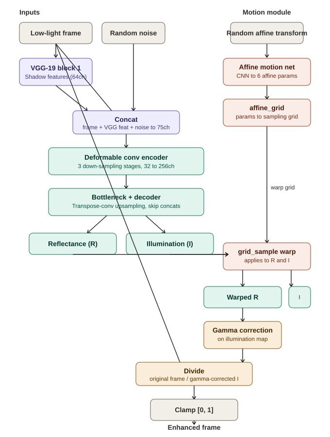

# ELVE-Retinex

An efficient, zero-reference deep learning model for low-light video enhancement based on an improved Retinex architecture.

PyTorch implementation of the paper:

> **Efficient Low Light Video Enhancement Based on Improved Retinex Algorithms**
> Sung-Ling Lee and Shih-Hsuan Yang
> IEEE ICMEW 2023

---

## Demo

| Input (low-light) | Enhanced (ours) |
|---|---|
|  |  |

---

## Architecture



The model builds on the RetinexDIP framework with three key improvements:

| Improvement | Component | Paper section |
|---|---|---|
| VGG-19 shadow features as DIP input | `VGGShadowFeatures` | §2.1 |
| Deformable convolution kernels | `DeformableConv2d` | §2.2 |
| Object-based affine optical flow | `AffineWarp` | §2.3 |

**Retinex model:** every observed frame S is decomposed as `S = (R + N) ⊙ I` where R = reflectance, I = illumination, N = noise. Enhancement = `S / γ-correct(I)`.

---

## Project structure

```
retinex_llve/
├── dataset.py         – Custom Dataset + DataLoader (train & eval modes)
├── model.py           – VGGShadowFeatures, DeformableConv2d, DIPNetwork,
│                         AffineWarp, RetinexVideoEnhancer
├── losses.py          – Reconstruction, Illumination-Consistency, Reflection,
│                         Illumination-Smoothness, RetinexLoss (combined)
├── metrics.py         – PSNR, SSIM, MABD, SPAQ (stub)
├── train.py           – Full training loop + CLI
├── enhance.py         – Inference on video files or frame folders
├── requirements.txt
├── samples/
│   ├── input.gif      – Example low-light input clip
│   └── enhanced.gif   – Corresponding enhanced output clip
└── architecture/
    └── unified_architecture.svg   – Full model architecture diagram
```

---

## Data setup

### Training (zero-reference — no GT required)

```
data/train/
    video_001/
        frame_0001.png
        frame_0002.png
        ...
    video_002/
        ...
```

### Evaluation (SDSD-style paired data)

```
data/eval/
    video_001/
        low/
            frame_0001.png
            ...
        high/
            frame_0001.png
            ...
    video_002/
        ...
```

---

## Installation

```bash
pip install -r requirements.txt
```

---

## Training

```bash
python train.py \
    --train_dir data/train \
    --eval_dir data/eval \
    --output_dir checkpoints \
    --epochs 50 \
    --img_size 512 \
    --clip_len 5 \
    --lr 1e-4 \
    --gamma 0.4
```

Key hyperparameters (matching paper):

| Argument | Default | Description |
|---|---|---|
| `--img_size` | 512 | Training resolution (paper: 512×512) |
| `--gamma` | 0.4 | Gamma correction exponent |
| `--lambda_rec` | 1.0 | Reconstruction loss weight |
| `--lambda_ic` | 1.0 | Illumination consistency weight |
| `--lambda_ref` | 0.1 | Reflection smoothness weight |
| `--lambda_sm` | 0.1 | Illumination smoothness weight |
| `--n_iters` | 1 | Inner DIP iterations per sample |

---

## Inference

```bash
# From a folder of frames
python enhance.py \
    --input path/to/dark_frames/ \
    --output path/to/output_frames/ \
    --checkpoint checkpoints/best_model.pth

# From a video file (requires OpenCV)
python enhance.py \
    --input samples/input.mp4 \
    --output samples/enhanced.mp4 \
    --checkpoint checkpoints/best_model.pth
```

The GIFs shown in the [Demo](#demo) section above are converted from the `.mp4` outputs of this exact command, for preview purposes only — `enhance.py` itself always operates on `.mp4` (or frame folders), not GIFs.

---

## Metrics (Table 1 in paper)

| Method | PSNR (dB) | SSIM | SPAQ (%) | MABD |
|---|---|---|---|---|
| RetinexDIP | 28.67 | 0.511 | 18.07 | 2.315 |
| StableLLVE | 27.73 | 0.484 | 28.99 | 0.985 |
| **Proposed** | **28.73** | **0.544** | 25.49 | 1.578 |

Run `metrics.py` functions directly or call `evaluate()` in `train.py`.

---

## Notes

- **Zero-reference**: no paired training data is required. Ground truth is only used for evaluation metrics.
- **SPAQ**: `metrics.py` includes a stub. To get real SPAQ scores, integrate the pretrained model from https://github.com/h4nwei/SPAQ.
- The paper records videos with a OnePlus 7T (48 MP Sony IMX586, f/1.6). Any outdoor low-light video footage should work.